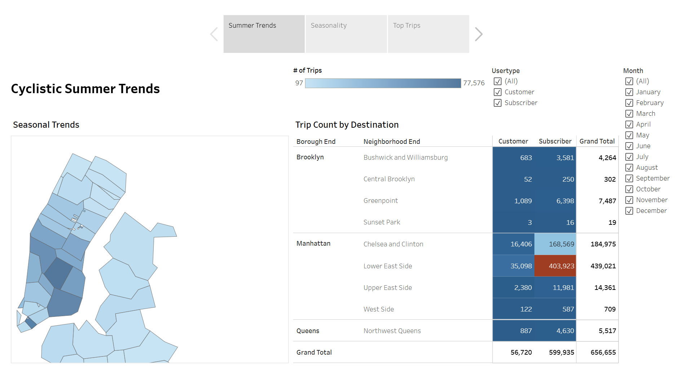

# Cyclistic Bikeshare Dashboard

> **Business Intelligence Portfolio Project**
>
> Originally developed as part of the **Google Business Intelligence Professional Certificate**. This portfolio version has been independently enhanced through comprehensive SQL documentation, business-focused storytelling, interactive Tableau visualization, and actionable business recommendations while preserving the original business case.

## Project Background

Cyclistic (Fictional Entity) is a bike-sharing company partnered with the City of New York, operating stations across Manhattan and neighboring boroughs. This project addresses a core business challenge: the Customer Growth Team lacks visibility into how customers use bikes across different locations and seasons, making it difficult to plan for new station expansion and targeted marketing.

As a Business Intelligence Analyst, I performed a full-cycle BI analysis — from stakeholder requirements gathering to interactive dashboard development — to provide data-driven recommendations for Cyclistic's upcoming business plan.

**Focus Areas:**
- **Seasonal Trends:** Identifying neighborhood demand patterns across seasons
- **Customer Behavior:** Comparative analysis of Subscribers vs. Customers
- **Station Demand:** Pinpointing high-traffic locations to guide infrastructure growth

---

## Quick Links
- 🔗 **SQL Query:** [View BigQuery SQL Script](cyclistic_query.sql)
- 📊 **Interactive Dashboard:** [View on Tableau Public](https://public.tableau.com/views/CyclisticBikeshareAnalysis_17769969566650/CyclisticBikeshareAnalysis?:language=en-US&:sid=&:redirect=auth&:display_count=n&:origin=viz_share_link)

---

## Data & Tools
Analyzed 656,655 trips from NYC Citi Bike, 
Census Bureau boundaries, and NOAA weather 
data via Google BigQuery SQL. 
Visualized in Tableau Public.

---

## Executive Summary

### Overview of Findings
Across **656,655 total trips**, Subscriber usage dominates at 91.4% (599,935 trips) while one-time Customers account for only 8.6% (56,720 trips) — a significant untapped conversion opportunity. Trip volume follows a strong seasonal pattern, peaking in August–October and dropping sharply in winter. Demand is heavily concentrated in Lower Manhattan, with the Lower East Side and Chelsea & Clinton consistently ranking as the highest-demand areas.

**Dashboard Preview:**

---

## Insights Deep Dive

**Category 1: Geographic Demand**
- **Top Destination:** Lower East Side leads with **439,021 trips**, more than double Chelsea & Clinton (184,975 trips)
- **Top Starting Neighborhoods:** Lower East Side (193,019), Chelsea & Clinton (170,097), and Gramercy Park (115,667) account for the majority of all trip starts
- **Borough Gap:** Manhattan dominates all trip activity; Brooklyn (max 11,730 trips per neighborhood) and Queens (4,163 trips) show significantly lower demand

**Category 2: Seasonality**
- **Peak Months:** Demand increased steadily from May and reached its highest levels during August–October, with September 2020 recording **47,893 trips**, the highest monthly volume across the analysis period.
- **Winter Decline:** January–February records the sharpest drops, falling to under 10,000 trips per month
- **YoY Growth:** Total trips increased from 282,930 in 2019 to 373,725 in 2020, indicating stronger overall ridership across the second year of analysis.

**Category 3: User Type Behavior**
- **Subscriber Dominance:** 599,935 Subscriber trips vs. 56,720 Customer trips — a **10.6x difference**
- **Conversion Gap:** Despite high trip volumes, Customers represent only 8.6% of all trips, indicating low incentive or awareness to subscribe
- **Consistent Pattern:** Subscriber activity is sustained year-round, while Customer activity spikes only in summer months

**Category 4: Trip Duration by Location**
- **Highest Trip Minutes (Starting):** Chelsea & Clinton (~200K minutes) and Lower East Side (~150K minutes) generate the most total trip time as starting points
- **Highest Trip Minutes (Destination):** Lower East Side (~800K minutes) far exceeds all other destinations, followed by Chelsea & Clinton (~600K minutes)
- This confirms that these two neighborhoods are the **core of Cyclistic's ridership ecosystem**

---

## Recommendations
- **New Station Placement:** Prioritize **Lower East Side** and **Chelsea & Clinton** for new stations — both rank #1 across trip count, trip starts, and trip minutes as destination
- **Seasonal Operations:** Scale bike availability up in **May–October** and down in **December–February** to optimize operational costs
- **Customer Conversion:** Launch summer loyalty programs targeting one-time Customers to drive subscription sign-ups during peak season, when the conversion opportunity is highest
- **Weather Strategy:** Introduce dynamic promotions on rainy or cold days to stabilize trip volume during weather-impacted periods

---

## Assumptions and Caveats
- **Date Shift:** Data is originally from 2014–2015; `DATE_ADD INTERVAL 5 YEAR` was applied to display as 2019–2020 for recency
- **Geographic Scope:** Limited to NYC stations with valid ZIP code matches in the reference table
- **Weather Assumption:** Daily precipitation is assumed to impact all trips on that day regardless of timing
- **Station Availability:** Trip counts reflect demand only — bike availability constraints are not accounted for
- **Privacy:** All personally identifiable information was excluded at the query level
- **Data Anomaly:** Sunset Park (Brooklyn) shows abnormally high average trip durations, likely due to unreturned bikes or data errors — noted but retained in dataset
