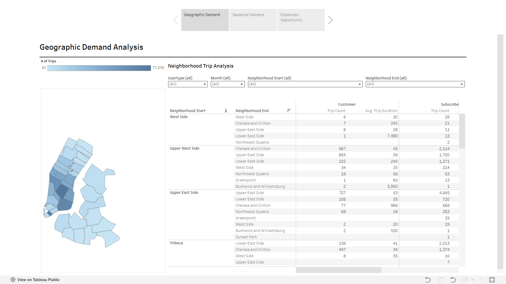
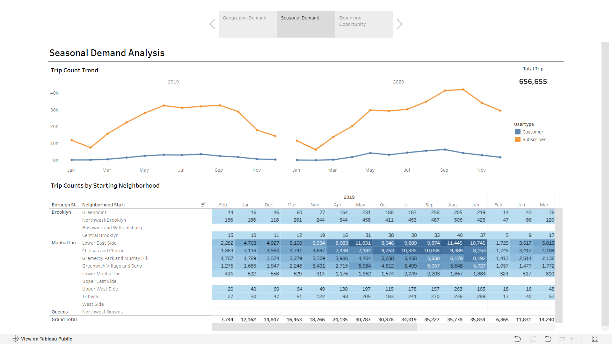
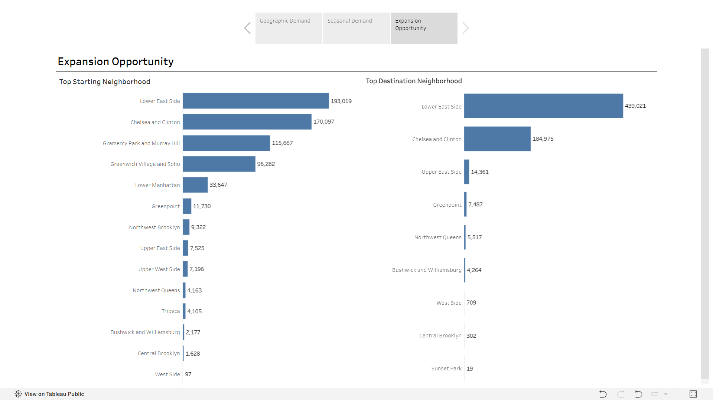

# Bikeshare Station Expansion Analysis: 656K+ NYC Trips

> **Business Intelligence Portfolio Project**
>
> Originally developed as part of the **Google Business Intelligence Professional Certificate** case study and independently expanded into a professional portfolio project. This portfolio version extends the original case study through comprehensive SQL documentation, business-focused storytelling, interactive Tableau dashboards, and actionable business recommendations while preserving the original business objective.

---

# Project Background

Cyclistic (fictional entity) is a bike-sharing company partnered with the City of New York, operating stations across Manhattan and neighboring boroughs.

The Customer Growth Team lacks visibility into customer travel behavior across different locations and seasons, making it difficult to optimize operations, identify future station expansion opportunities, and develop effective customer growth strategies.

As a **Business Intelligence Analyst**, I developed an end-to-end BI solution using **Google BigQuery SQL** and **Tableau**, transforming raw trip, geographic, and weather data into business insights that support data-driven decision making.

## Business Objectives

- Identify neighborhoods with the highest bike demand.
- Analyze seasonal demand patterns.
- Compare Subscriber and Customer behavior.
- Recommend operational improvements and station expansion opportunities.

---

# Quick Links

- 🔗 **SQL Query:** [View BigQuery SQL Script](cyclistic_query.sql)
- 📊 **Interactive Dashboard:** https://public.tableau.com/views/BikeshareStationExpansionAnalysis656KNYCTrips/CyclisticBikeshareAnalysis?:language=en-US&:sid=&:redirect=auth&:display_count=n&:origin=viz_share_link

---

# Data & Tools

### Data Sources

- NYC Citi Bike Trips
- US ZIP Code Boundaries
- NYC ZIP Code Reference Table
- NOAA Daily Weather Data

### Tools

- Google BigQuery
- SQL
- Tableau Public

### Dataset

- **656,655 bike trips**
- Spatial SQL
- Geographic enrichment
- Weather enrichment
- Analysis-ready flat table

---

# Executive Summary

Across **656,655 bike trips**, demand is highly concentrated within a small number of Manhattan neighborhoods, particularly **Lower East Side** and **Chelsea & Clinton**, making these locations the primary activity centers within Cyclistic's network.

Bike demand follows a clear seasonal pattern, increasing steadily from spring, peaking during **September**, and declining significantly throughout the winter months. Subscriber trips account for more than **91%** of total rides, indicating that recurring members remain the primary driver of business performance while Customers represent a significant membership growth opportunity.

These findings provide actionable insights for operational planning, customer growth strategies, and future station expansion.

---

# Dashboard Preview

## Geographic Demand Analysis

## Seasonal Demand Analysis

## Expansion Opportunity

---

# Dashboard 1 — Geographic Demand Analysis

## Business Question

**Which neighborhoods generate the highest bike demand, and how does demand vary across different locations?**

### Key Insights

- Bike demand is highly concentrated in a small number of neighborhoods. **Lower East Side** generated the highest trip volume, followed by **Chelsea & Clinton** and **Gramercy Park**, while several neighborhoods recorded substantially lower demand.

- Subscriber trips consistently exceeded Customer trips across nearly all high-demand routes, indicating that recurring members remain the primary driver of Cyclistic's ridership.

- High-demand routes are concentrated within neighboring areas, particularly around Lower East Side and Chelsea & Clinton, suggesting that bike usage is largely driven by short-distance urban mobility.

- Although some neighborhoods generated relatively low trip volumes, they recorded longer average trip durations, indicating that trip frequency and travel duration do not necessarily increase together.

### Business Recommendations

- Prioritize bike availability and station capacity in **Lower East Side** and **Chelsea & Clinton** to accommodate consistently high demand.

- Use subscriber travel patterns as the foundation for operational planning while developing campaigns to convert Customers into Subscribers.

- Investigate neighborhoods with unusually long average trip durations but low demand to identify potential operational improvements.

---

# Dashboard 2 — Seasonal Demand Analysis

## Business Question

**How does bike demand change throughout the year, and how can Cyclistic use these seasonal patterns to improve customer growth strategies?**

### Key Insights

- Trip demand followed a consistent seasonal pattern across both years, increasing steadily from **March** and reaching its highest level in **September**. The peak occurred in **September 2020 with 47,893 trips**.

- Demand declined significantly after **October** and reached its lowest level during **February** (**7,744 trips in 2019** and **6,365 trips in 2020**), indicating lower seasonal demand during winter.

- Subscriber usage remained consistently higher than Customer usage throughout the analysis period, showing that subscribers are the primary contributors to Cyclistic's ridership while customers represent an opportunity for future membership growth.

### Business Recommendations

- Increase bike availability and operational capacity during **May–September** to support peak demand.

- Launch targeted promotions during winter months to reduce seasonal demand decline.

- Focus customer acquisition campaigns during high-demand periods to improve Customer-to-Subscriber conversion.

---

# Dashboard 3 — Expansion Opportunity

## Business Question

**Which neighborhoods should Cyclistic prioritize for future station expansion based on trip demand?**

### Key Insights

- **Lower East Side** ranked first as both a trip origin (**193,019 trips**) and destination (**439,021 trips**), demonstrating consistently high travel demand.

- **Chelsea & Clinton** also generated consistently high trip volumes, making it another strategic candidate for future station expansion.

- Demand is heavily concentrated within only a few neighborhoods, indicating that infrastructure investment should initially focus on the highest-performing service areas.

### Business Recommendations

- Prioritize station expansion in **Lower East Side** and **Chelsea & Clinton** to improve service availability.

- Increase docking capacity and bike allocation in neighborhoods with consistently high demand.

- Evaluate low-demand neighborhoods carefully before investing in additional infrastructure to ensure expansion decisions remain data-driven.

---

# Assumptions & Limitations

- **Date Adjustment:** The original dataset covers **2014–2015**. Dates were shifted forward by five years using `DATE_ADD()` for presentation purposes while preserving seasonal patterns.

- **Weather Coverage:** Weather data represents daily conditions from the Central Park NOAA weather station and is assumed to reflect conditions experienced across NYC on the same day.

- **Geographic Mapping:** Neighborhoods were assigned using Spatial SQL based on ZIP Code polygons.

- **Demand Representation:** Trip counts represent customer demand only and do not account for bike availability or station capacity constraints.

- **Data Anomaly:** Some neighborhoods contain unusually long average trip durations, which may reflect recreational travel, incomplete trips, or data quality issues rather than normal commuting behavior.

---

# Skills Demonstrated

- Business Intelligence
- SQL (Google BigQuery)
- Spatial SQL (`ST_GEOGPOINT`, `ST_WITHIN`)
- Data Cleaning
- ETL
- Data Modeling
- Geographic Analysis
- Dashboard Design
- Business Storytelling
- Data Visualization (Tableau)
